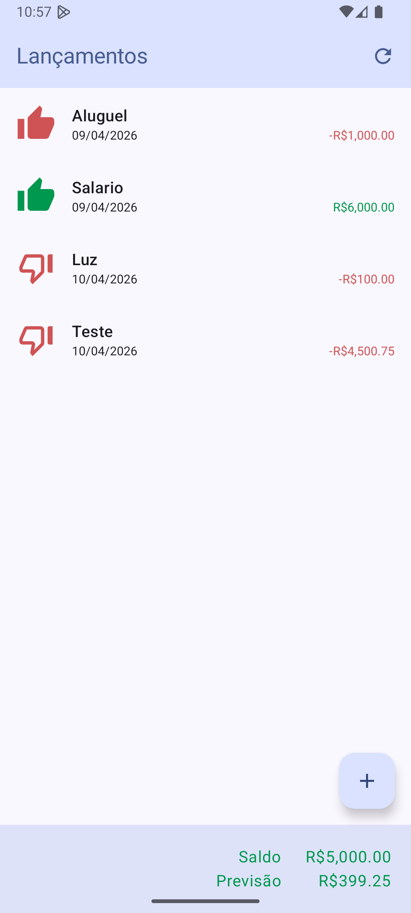
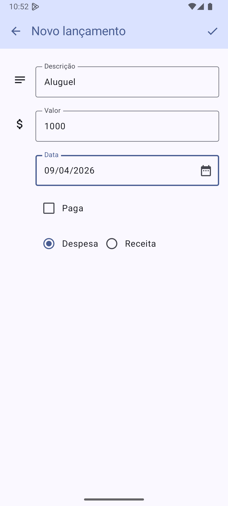

Atendendo as especificações solicitadas, foram ajustados os arquivos abaixo para realizar os ajustes demandados

app/src/main/java/br/edu/utfpr/trabalhofinal/ui/lancamento/lista/ListaLancamentosScreen.kt
app/src/main/java/br/edu/utfpr/trabalhofinal/ui/lancamento/form/FormularioLancamentoScreen.kt
app/src/main/java/br/edu/utfpr/trabalhofinal/ui/lancamento/form/FormularioLancamentoViewModel.kt
app/src/main/java/br/edu/utfpr/trabalhofinal/ui/lancamento/form/composables/FormTextField.kt
app/src/main/res/values/strings.xml

Como estava antes
O sistema exibia cada item da lista de lancamentos utilizando um componente padrao que agrupava todas as informacoes em uma unica linha de texto. Os dados de data, descricao, valor e status apareciam concatenados, sem diferenciacao visual entre receitas e despesas. Na barra inferior, os valores de saldo e previsao utilizavam a cor padrao do tema, sem destacar se o resultado era positivo ou negativo. No formulario, os campos de descricao e valor nao possuiam icones, a data era um campo de texto comum que permitia digitacao livre e a exclusao de registros ocorria imediatamente apos o clique, sem pedir confirmacao ao usuario. Os botoes de selecao no final do formulario tambem ficavam desalinhados em relacao ao inicio dos campos de texto.

Codigo anterior
@Composable
private fun List(...) {
    LazyColumn(modifier = modifier) {
        items(lancamentos) { lancamento ->
            val pago = if (lancamento.paga) "pago" else "pendente"
            val descricao = "${lancamento.data.formatar()} - ${lancamento.descricao} - ${lancamento.valor} - $pago"
            ListItem(
                modifier = Modifier.clickable { onLancamentoPressed(lancamento) },
                headlineContent = { Text(descricao) },
            )
        }
    }
}

@Composable
private fun FormContent(...) {
    FormTextField(
        label = stringResource(R.string.descricao),
        value = descricao.valor,
        onValueChanged = onDescricaoAlterada,
    )
    FormTextField(
        label = stringResource(R.string.valor),
        value = valor.valor,
        onValueChanged = onValorAlterado,
    )
    // ...
}

Como ficou depois
Eu modernizei o layout para melhorar a experiencia do usuario. Agora cada item apresenta um icone colorido a esquerda que indica se o lancamento foi pago ou esta pendente. No layout da listagem, eu garanti que a descricao ocupe a primeira linha sozinha e que a segunda linha contenha a Data alinhada a esquerda e o Valor alinhado a direita. Implementei uma logica de cores utilizando os valores hexadecimais 0xFFCF5355 para despesas ou negativos e 0xFF00984E para receitas ou positivos, tanto na lista quanto na barra de totalizadores. Eu utilizei a funcao formatar ja existente no projeto e garanti que o sinal de menos apareca antes do cifrao para valores negativos.

No formulario, eu adicionei icones descritivos externos (Notes e AttachMoney) posicionados a esquerda dos campos de descricao e valor para guiar visualmente o preenchimento. Garanti que todos os campos, incluindo Data, Paga e os tipos de lancamento, mantenham um alinhamento vertical perfeito, respeitando o espaco reservado para esses icones externos. Substitui o campo de texto da data por um componente de selecao de data (DatePicker) e implementei uma camada de seguranca que solicita a confirmacao do usuario antes de excluir qualquer registro. Tambem melhorei as validacoes para garantir que o campo de valor seja obrigatorio e aceite apenas numeros validos com ponto decimal, evitando falhas inesperadas no aplicativo.

Telas do Sistema
Abaixo apresento como ficaram as telas apos minhas alteracoes, seguindo as diretrizes visuais solicitadas.

Lista de Lancamentos

Formulario de Lancamento

Codigo alterado
@Composable
private fun List(...) {
    LazyColumn(modifier = modifier) {
        items(lancamentos) { lancamento ->
            val color = if (lancamento.tipo == TipoLancamentoEnum.DESPESA) Color(0xFFCF5355) else Color(0xFF00984E)
            val icon = if (lancamento.paga) Icons.Filled.ThumbUp else Icons.Filled.ThumbDownOffAlt
            val valorFormatado = if (lancamento.tipo == TipoLancamentoEnum.DESPESA) "-${lancamento.valor.formatar()}" else lancamento.valor.formatar()

            Row(...) {
                Icon(imageVector = icon, tint = color, ...)
                Column(...) {
                    Text(text = lancamento.descricao, ...)
                    Row(...) {
                        Text(text = lancamento.data.formatar(), ...)
                        Text(text = valorFormatado, color = color, ...)
                    }
                }
            }
        }
    }
}

@Composable
fun FormTextField(...) {
    Row(...) {
        Box(modifier = Modifier.size(40.dp)) {
            leadingIcon?.invoke()
        }
        Spacer(modifier = Modifier.width(8.dp))
        Column(modifier = Modifier.weight(1f)) {
            OutlinedTextField(...)
        }
    }
}
